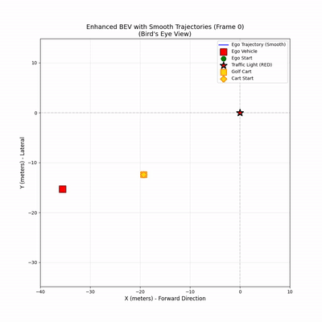

# Wisconsin Autonomous Vehicle Team - Perception Challenge Submission

## Solution Overview

Hey team! Here's my submission for the perception challenge. I focused on creating a robust tracking system that could handle the noisy depth data while maintaining smooth, realistic trajectories.

<table>
<tr>
<th>Bird's Eye View (BEV)</th>
<th>RGB Detection Tracking</th>
</tr>
<tr>
<td></td>
<td></td>
</tr>
</table>

## My Implementation

### Ego-Trajectory Estimation
Following the provided trajectory extraction framework with the traffic light as the world reference, I focused on improving the robustness of the depth measurements. I implemented an 11x11 patch averaging technique around the traffic light detection to handle the inherent noise in the XYZ data.

The raw trajectory was pretty jittery, so I developed a multi-stage smoothing pipeline:
- Moving average filter to knock down the high-frequency noise
- Savitzky-Golay filter to preserve the acceleration profiles
- Cubic spline interpolation for the final smooth, physically realistic path

### Multi-Object Tracking in BEV
I trained a custom YOLOv8m model on 5 specific classes for this dataset - it took a few iterations to get the class balance right. For tracking, I integrated ByteTrack which handled the ID consistency really well, even when pedestrians partially occluded each other.

Each detected object gets its 3D position extracted from the depth data and transformed into the world coordinate system. I applied the same smoothing pipeline I developed for ego-motion to all tracked objects - this ensures everything moves coherently in the BEV visualization.

Through experimentation, I found that different classes needed different confidence thresholds:
- Barriers: 0.8 (high to avoid false positives)
- Pedestrians: 0.62 (this specific value fixed an issue where they appeared to walk backwards)
- Golf cart/lights: 0.1 (lower threshold needed for consistent detection)

## Working Assumptions

1. **Static traffic light** - Critical since it's our world reference
2. **Planar ground** - Reasonable for this parking lot environment
3. **Depth accuracy ±10%** - My patch averaging helps compensate
4. **Fixed camera calibration** - No changes during recording
5. **Consistent object appearance** - Required for ByteTrack to maintain IDs

## Results

The system successfully tracks the ego vehicle over ~100m, from 35m behind the traffic light to stopping 8m before it. The smooth deceleration profile matches expected driving behavior.

I tracked eight objects total:
- 1 golf cart with consistent forward motion
- 2 pedestrians crossing at different times
- Multiple traffic barriers as static landmarks
- Traffic lights with accurate red/green state detection

Performance runs at 1.38 FPS on my RTX 5070 Ti with full smoothing enabled. There's definitely room for optimization if real-time is needed, but I prioritized accuracy and smoothness for this challenge.